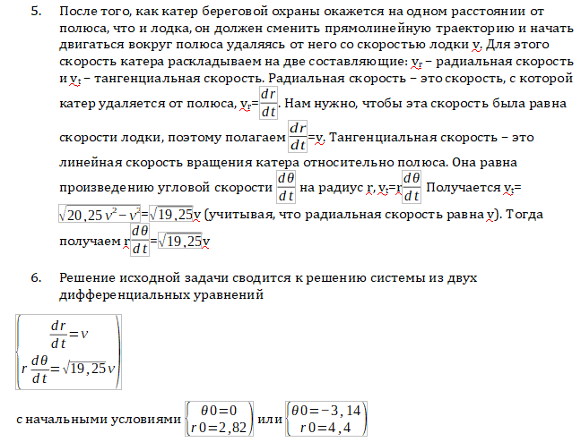
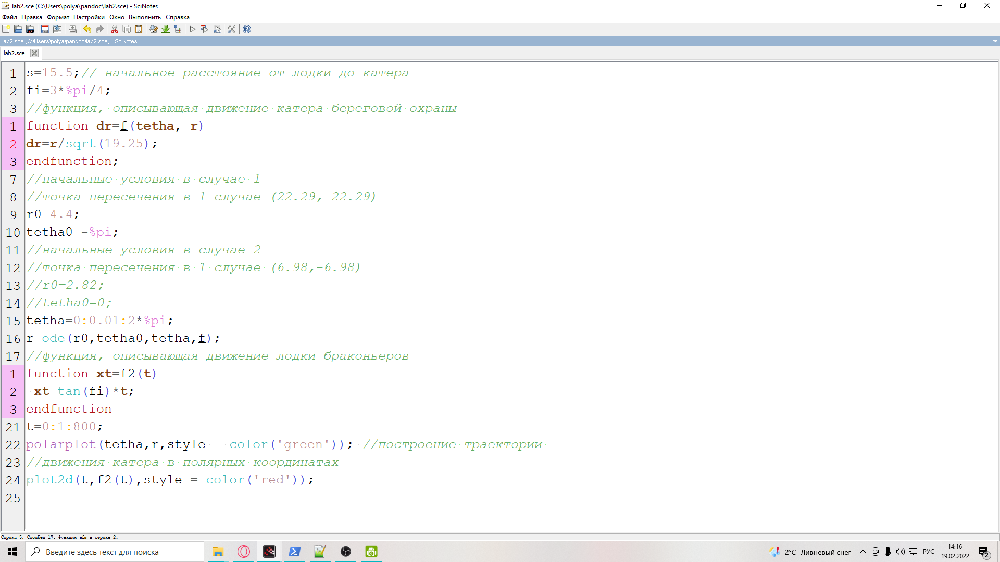

---
## Front matter
lang: ru-RU
title: Lab2 The task of the chase
author: Pozdnyakov Danila Romanovich
institute: RUDN University, Moscow, Russian Federation
date: 2022, 12 February

## Formatting
toc: false
slide_level: 2
theme: metropolis
header-includes: 
 - \metroset{progressbar=frametitle,sectionpage=progressbar,numbering=fraction}
 - '\makeatletter'
 - '\beamer@ignorenonframefalse'
 - '\makeatother'
aspectratio: 43
section-titles: true
---

# Aim of work
Learn how to work with the Git version control system.

# Сalculation of formulas

{width=100%}

# Building a model in Scilab

{width=100%}